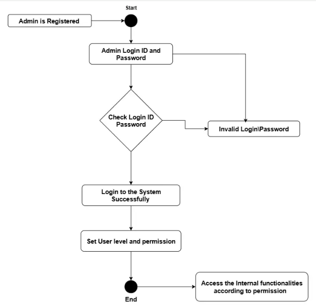
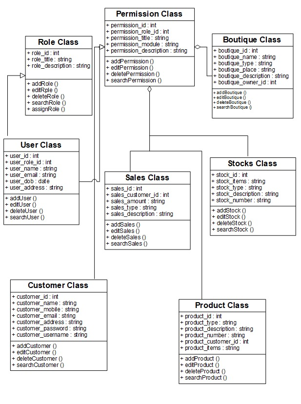
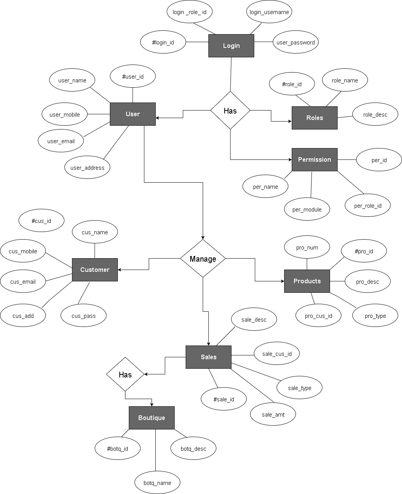
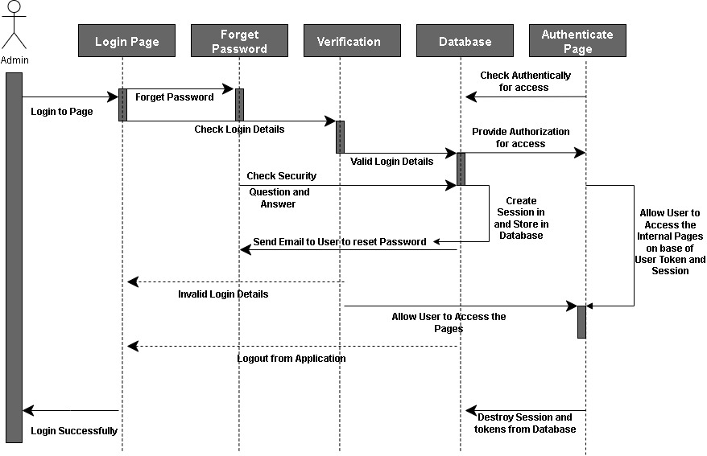
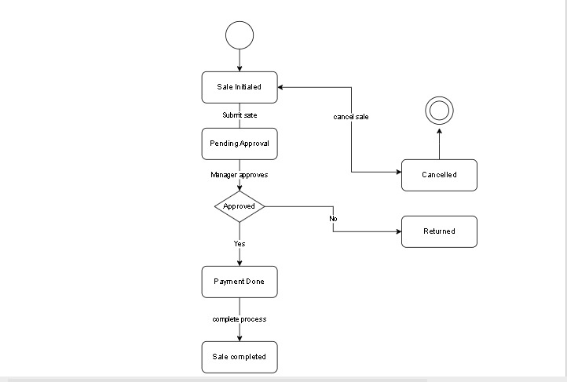

<<<<<<< HEAD
# Boutique Management System 👗🧾

A simple Java-based Boutique Management System that simulates the core functionalities of managing a boutique shop — from products and customers to sales and inventory.

## 🚀 Project Overview

This project was developed as part of a learning exercise to practice Object-Oriented Programming (OOP), UML modeling, and version control with Git and GitHub.

The system includes:

- Managing boutique details
- Managing products
- Managing customer information
- Tracking stock levels
- Recording sales transactions
- Handling user/admin access

## 📁 Technologies Used

- Java (Console-based)
- Git & GitHub for version control

## 📦 Features

- Add and manage boutique details (name, owner, location, etc.)
- Create products with price and quantity
- Register customers with login credentials
- Track available stock for each product
- Process sales and update inventory
- Simple role-based user class (`User` with role like Admin)

## 🏗️ System Structure

The system includes the following classes:

| Class       | Responsibility                                      |
|-------------|------------------------------------------------------|
| `Boutique`  | Represents the boutique details                      |
| `Product`   | Stores product info: name, type, price, quantity     |
| `Customer`  | Stores customer info and login credentials           |
| `Sales`     | Handles sales records and sale dates                 |
| `Stock`     | Tracks available quantities for each product         |
| `User`      | Represents users with roles (e.g., Admin)            |
| `Main`      | Runs and tests all class interactions                |

## 📊 UML Diagrams

## 🧠 Skills Practiced

- Java OOP (constructors, getters/setters)
- UML-to-code translation
- Git basics: init, commit, push
- Working with multiple Java classes

## 📌 Author

**Sara Talat**  
Bis Senior Student at Modern Academy

---

## ✅ Future Improvements

- Add GUI using JavaFX or Swing
- Connect to a real database (MySQL)
- Enable search and filter features
- Add login/logout system with roles

## 📷 Example Output

Boutique Name: Elegance Boutique
Owner: Sara
Product Name: Evening Dress
Product Price: 1200.0
Customer: Mona Ahmed
Username: mona22
Address: Nasr City, Cairo
Stock for Product ID 101: 8 items
Sale ID: 1
Quantity Sold: 2
Sale Date: Wed Aug 27 23:34:05 EEST 2025
User: admin1 | Role: Admin

=======
## UML Diagrams

### Class Diagram

### Sequence Diagram

>>>>>>> 04ed331 (Update README with UML diagrams)
